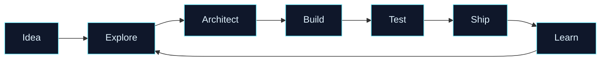

<p align="center">
<a href="https://github.com/LechehebDjaafar">
    
  </a>
</p> <p align="center">
  <a href="https://readme-typing-svg.demolab.com/">
    
  </a>
</p> <p align="center">
  
  <a href="https://github.com/LechehebDjaafar?tab=followers"></a>
  <a href="https://github.com/LechehebDjaafar?tab=repositories"></a>
</p> <p align="center">
  <a href="#-navigation">Navigation</a> •
  <a href="#-about-the-operator">About</a> •
  <a href="#-arsenal">Arsenal</a> •
  <a href="#-mission-control">Mission Control</a> •
  <a href="#-connect">Connect</a>
</p> <p align="center">
  
</p>

## ◈ Navigation

| Sector | Destination | What you will find |
| --- | --- | --- |
| `01` | [About the Operator](#-about-the-operator) | Background, mindset, and current focus |
| `02` | [Arsenal](#-arsenal) | Languages, frameworks, platforms, and tools |
| `03` | [Mission Control](#-mission-control) | Live GitHub activity and engineering metrics |
| `04` | [Operating System](#-operating-system) | How I approach building software |
| `05` | [Connection Channel](#-connect) | Social links and collaboration routes |
| `06` | [Transmission Log](#-transmission-log) | Expandable notes, commands, and extras |
| `07` | [Neon Showcase](#-neon-showcase-deck) | Featured repositories and latest article feed |
| `08` | [Interactive Terminal](#-interactive-terminal) | Read-only terminal and open-code panels |

<details>
<summary><strong>▸ Open the quick command panel</strong></summary>

```
$ whoami
Lecheheb Djaafar — Python Expert from Algeria 🇩🇿

$ mission --status
ONLINE: building useful, secure, and scalable digital systems

$ focus --now
Python • Full-Stack Engineering • AI/Data • Cybersecurity

$ collaboration --mode
OPEN: innovative products, automation, cross-platform tools, and security projects
```

</details>

## ◈ Neon Showcase Deck

<p align="center">

</p> <table>
  <tr>
    <td width="50%" valign="top">
      <h3>⚡ local-ai-hub</h3>
      <p>An interactive guide for finding local AI models that match your hardware, plus a comparison of AI coding agents.</p>
      <p><a href="https://lechehebdjaafar.github.io/local-ai-hub/"><strong>OPEN LIVE DEMO ↗</strong></a> · <a href="https://github.com/LechehebDjaafar/local-ai-hub"><strong>SOURCE CODE</strong></a></p>
      <p> </p>
    </td>
    <td width="50%" valign="top">
      <h3>♞ fenrix</h3>
      <p>A modern high-performance UCI chess engine, presented as a focused engineering experiment.</p>
      <p><a href="https://github.com/LechehebDjaafar/fenrix"><strong>OPEN REPOSITORY ↗</strong></a></p>
      <p> </p>
    </td>
  </tr>
  <tr>
    <td width="50%" valign="top">
      <h3>🃏 blackjackai</h3>
      <p>A compact Python project exploring game logic and AI-flavored decision systems.</p>
      <p><a href="https://github.com/LechehebDjaafar/blackjackai"><strong>OPEN REPOSITORY ↗</strong></a></p>
      <p></p>
    </td>
    <td width="50%" valign="top">
      <h3>♣ Texas_Holdem</h3>
      <p>A Python card-game build with a clean, focused scope and room for future expansion.</p>
      <p><a href="https://github.com/LechehebDjaafar/Texas_Holdem"><strong>OPEN REPOSITORY ↗</strong></a></p>
      <p></p>
    </td>
  </tr>
</table>

### Live article feed

<p align="center">

</p> <!-- BLOG-POST-LIST:START -->

- 📡 Add your RSS feed URL to `.github/workflows/blog-post-workflow.yml` to populate this panel automatically.

<!-- BLOG-POST-LIST:END --> <details>
<summary><strong>▸ Article feed setup</strong></summary>

This panel is ready for any RSS-compatible blog, Dev.to feed, YouTube feed, or personal website. Add a repository variable named `BLOG_RSS_URL` under **Settings → Secrets and variables → Actions → Variables**; GitHub Actions will refresh the list once per day and on demand.

</details>

## ◈ Interactive Terminal

<p align="center">

</p>

```
visitor@lecheheb:~$ help

  about       show operator profile
  arsenal     inspect the technology stack
  projects    open featured repositories
  articles    stream the latest article feed
  connect     open collaboration channels
  snake       launch the contribution arcade

visitor@lecheheb:~$ status
[ ONLINE ] Python / AI / Full-Stack / Cybersecurity
[ SIGNAL ] stable
[ MODE   ] building in public

visitor@lecheheb:~$ connect --ready
Awaiting your idea...
```

<details>
<summary><strong>▸ Open terminal notes</strong></summary>

This is a visual, read-only terminal interface inside a GitHub README. GitHub does not execute JavaScript or arbitrary commands inside README files, so the terminal is intentionally visible as a cinematic presentation rather than a real shell. Use the links in the Showcase section to open the actual projects.

</details>

### Open code explorer

<details>
<summary><strong>▸ profile.py — the operator module</strong></summary>

```python
class LechehebDjaafar:
    location = "Algeria"
    focus = ["Python", "AI", "Full-Stack", "Cybersecurity"]
    runtime = "curiosity + Algerian coffee"

    def build(self, idea: str ) -> str:
        return f"{idea} -> useful, secure, maintainable software"

    def collaborate(self) -> bool:
        return True
```

</details> <details>
<summary><strong>▸ mission.py — execution protocol</strong></summary>

```python
pipeline = [
    "discover the real problem",
    "design the smallest useful system",
    "build with readable code",
    "test, secure, and document",
    "ship, observe, improve",
]
```

</details> <details>
<summary><strong>▸ system.log — latest signal</strong></summary>

```
[OK] Profile interface loaded
[OK] Neon showcase connected
[OK] Article feed awaiting RSS source
[OK] Contribution arcade configured
[READY] Collaboration channel open
```

</details>

## ◈ About the Operator

> I am **Lecheheb Djaafar**, a Python-focused full-stack developer and cybersecurity engineer from Algeria. I enjoy turning complex ideas into clean, useful, and resilient software systems.

My work sits at the intersection of **software engineering, artificial intelligence, automation, data, and defensive security**. I care about readable code, thoughtful architecture, strong developer experience, and products that feel as good to use as they are to maintain.

<table>
<tr>
    <td width="50%" valign="top">
      <h3>Current coordinates</h3>
      <p>🌍 Algeria  
🐍 Python-first engineering  
🛡️ Security-minded development  
🧠 Exploring AI and data science  
☕ Powered by Algerian coffee</p>
    </td>
    <td width="50%" valign="top">
      <h3>Open frequencies</h3>
      <p>🤝 Innovative Python projects  
⚙️ Cross-platform applications  
🔬 Machine-learning experiments  
🌐 Full-stack products  
🚀 Creative technical collaborations</p>
    </td>
  </tr>
</table>

### What I bring to the room

| Capability | Perspective |
| --- | --- |
| **Engineering** | I design practical solutions with maintainability, performance, and clarity in mind. |
| **Python** | I use Python for automation, APIs, data workflows, machine learning, and rapid product development. |
| **Security** | I think about trust boundaries, attack surfaces, privacy, and safer defaults from the beginning. |
| **Learning** | I continuously explore emerging frameworks, libraries, AI systems, and data-science techniques. |
| **Collaboration** | I value direct communication, documented decisions, useful feedback, and shared ownership. |

## ◈ Arsenal

### Core technologies

<p align="center">
<a href="https://skillicons.dev">
    
  </a>
</p>

### Data, vision, and infrastructure

<p align="center">
<a href="https://skillicons.dev">
    
  </a>
</p> <table>
  <tr>
    <td width="33%" valign="top">
      <h3>Frontend</h3>
      <p align="center"></p>
      <p align="center"><sub>Interfaces that are responsive, expressive, and easy to navigate.</sub></p>
    </td>
    <td width="33%" valign="top">
      <h3>Backend</h3>
      <p align="center"></p>
      <p align="center"><sub>APIs, automation, services, data flows, and reliable application logic.</sub></p>
    </td>
    <td width="33%" valign="top">
      <h3>DevOps & Security</h3>
      <p align="center"></p>
      <p align="center"><sub>Reproducible environments, version control, and security-aware delivery.</sub></p>
    </td>
  </tr>
</table>

### Learning radar

```
                    ┌─────────────────────────────────────┐
                    │          LEARNING RADAR              │
                    ├─────────────────────────────────────┤
                    │  AI & Machine Learning       ████████│
                    │  Advanced Python              ████████│
                    │  Cybersecurity                ███████░│
                    │  Cloud & DevOps                ██████░░│
                    │  Data Engineering              ██████░░│
                    │  Cross-platform development    █████░░░│
                    └─────────────────────────────────────┘
```

> The radar represents areas of active exploration, not fixed skill scores. Every project is another opportunity to learn in public.

## ◈ Mission Control

<p align="center">

  
</p> <p align="center">
  
</p> <p align="center">
  <a href="https://github.com/LechehebDjaafar?tab=repositories">
    
  </a>
</p> <p align="center">
  
</p>

### Contribution constellation

> **Important:** the snake animation appears only after the `snake.yml` workflow completes successfully and publishes the generated files to the `output` branch.

<p align="center">

</p> <p align="center">
  <picture>
    <source media="(prefers-color-scheme: dark )" srcset="https://raw.githubusercontent.com/LechehebDjaafar/LechehebDjaafar/output/github-contribution-grid-snake-dark.svg" />
    <source media="(prefers-color-scheme: light )" srcset="https://raw.githubusercontent.com/LechehebDjaafar/LechehebDjaafar/output/github-contribution-grid-snake.svg" />
    
  </picture>
</p> <p align="center">
  <a href="https://github.com/Platane/snk">
    
  </a>
</p> <p align="center"><sub>Snake Arcade: the animation consumes your contribution grid as a neon trail. Click it to inspect the generator.</sub></p> <details>
<summary><strong>▸ Enable the animated contribution snake</strong></summary>

Create `.github/workflows/snake.yml` in the profile repository and add the following workflow. It will generate the animation in the `output` branch.

```yaml
name: Generate contribution snake

on:
  schedule:
    - cron: "0 0 * * *"
  workflow_dispatch:

jobs:
  generate:
    permissions:
      contents: write
    runs-on: ubuntu-latest
    steps:
      - name: Generate snake animation
        uses: Platane/snk@v3
        with:
          github_user_name: ${{ github.repository_owner }}
          outputs: |
            dist/github-contribution-grid-snake.svg
            dist/github-contribution-grid-snake-dark.svg?palette=github-dark
            dist/github-contribution-grid-snake.gif?color_snake=67E8F9&color_dots=0D1117,312E81,7C3AED,06B6D4,F59E0B

      - name: Publish animation
        uses: crazy-max/ghaction-github-pages@v5
        with:
          target_branch: output
          build_dir: dist
        env:
          GITHUB_TOKEN: ${{ secrets.GITHUB_TOKEN }}
          BUILD_DIR: dist
```

</details>

## ◈ Operating System

<table>
<tr>
    <td width="25%" align="center"><strong>01</strong>  
<sub>Discover</sub></td>
    <td width="25%" align="center"><strong>02</strong>  
<sub>Design</sub></td>
    <td width="25%" align="center"><strong>03</strong>  
<sub>Build</sub></td>
    <td width="25%" align="center"><strong>04</strong>  
<sub>Refine</sub></td>
  </tr>
  <tr>
    <td valign="top">Understand the problem, users, constraints, and the smallest useful outcome.</td>
    <td valign="top">Shape the architecture, interfaces, data flow, and security boundaries before the code grows.</td>
    <td valign="top">Ship in small, testable increments with readable code and meaningful documentation.</td>
    <td valign="top">Observe, measure, secure, simplify, and improve the system after the first milestone.</td>
  </tr>
</table>



## ◈ Connect

<p align="center">
<a href="https://github.com/LechehebDjaafar"></a>
  <a href="https://www.youtube.com/@CodeCraftDL"></a>
  <a href="https://www.facebook.com/djaafarlecheheb20/"></a>
  <a href="https://www.instagram.com/ddos_attack_co/"></a>
</p> <p align="center">
  <a href="https://www.youtube.com/@CodeCraftDL">
    
  </a>
</p> <details>
<summary><strong>▸ Collaboration protocol</strong></summary>

If you are building an ambitious Python product, an automation system, a full-stack application, an AI experiment, or a security-focused project, open a conversation through one of the channels above. The best first message includes the problem, desired outcome, current state, and kind of collaboration you have in mind.

</details>

## ◈ Transmission Log

<details>
<summary><strong>▸ Personal manifesto</strong></summary>

```
Build with curiosity.
Secure with intention.
Document what matters.
Automate the repetitive.
Stay humble around complexity.
Leave every system better than you found it.
```

</details> <details>
<summary><strong>▸ Random developer quote</strong></summary> <p align="center">
  
</p>
</details> <details>
<summary><strong>▸ The coffee-powered runtime</strong></summary> <p align="center">
  
</p> <p align="center"><em>Some of the best debugging sessions begin with a quiet desk and Algerian coffee.</em></p>
</details>

## ◈ Final transmission

<p align="center">
<strong>Thanks for entering my corner of the GitHub universe.</strong>  

  If something here sparks an idea, feel free to open an issue, start a discussion, or reach out.
</p> <p align="center">
  
</p>

## References

[1]: https://capsule-render.vercel.app/ "Capsule Render"

[2]: https://readme-typing-svg.demolab.com/ "Readme Typing SVG"

[3]: https://github.com/anuraghazra/github-readme-stats "GitHub Readme Stats"

[4]: https://streak-stats.demolab.com/ "GitHub Readme Streak Stats"

[5]: https://github.com/ashutosh00710/github-readme-activity-graph "GitHub Readme Activity Graph"

[6]: https://skillicons.dev/ "Skill Icons"

[7]: https://github.com/Platane/snk "Contribution Snake"

[8]: https://github.com/crazy-max/ghaction-github-pages "GitHub Pages deploy action"

[9]: https://quotes-github-readme.vercel.app/ "Quotes GitHub Readme"

[10]: https://img.shields.io/ "Shields.io"

<p align="center"><sub>Designed as a cinematic, interactive, GitHub-compatible profile README.</sub></p> <!--
Customization checklist:
1. Keep the username consistent: LechehebDjaafar.
2. Add verified LinkedIn, X/Twitter, or email links if desired.
3. Add readme.gif to the repository only if you want a local hero animation.
4. Enable the snake workflow above for the contribution animation.
5. Pin your strongest repositories so visitors see them immediately.

GitHub sanitizes arbitrary CSS and JavaScript in README files. The interactive
layer therefore uses supported anchors, details/summary panels, responsive
images, live SVG endpoints, Mermaid, and accessible alt text.
-->
